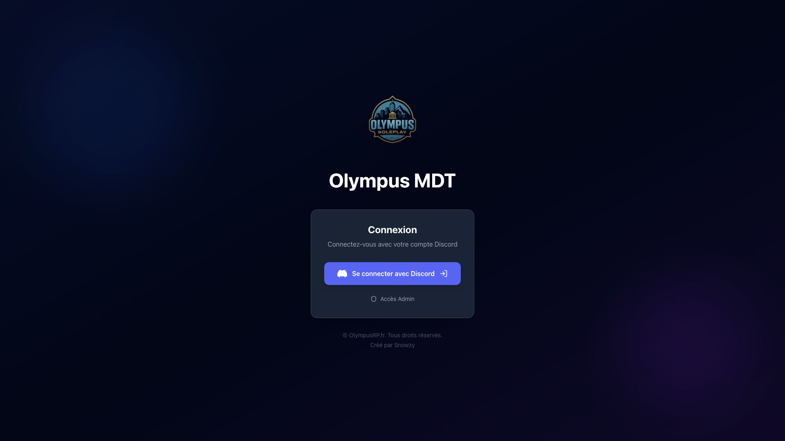
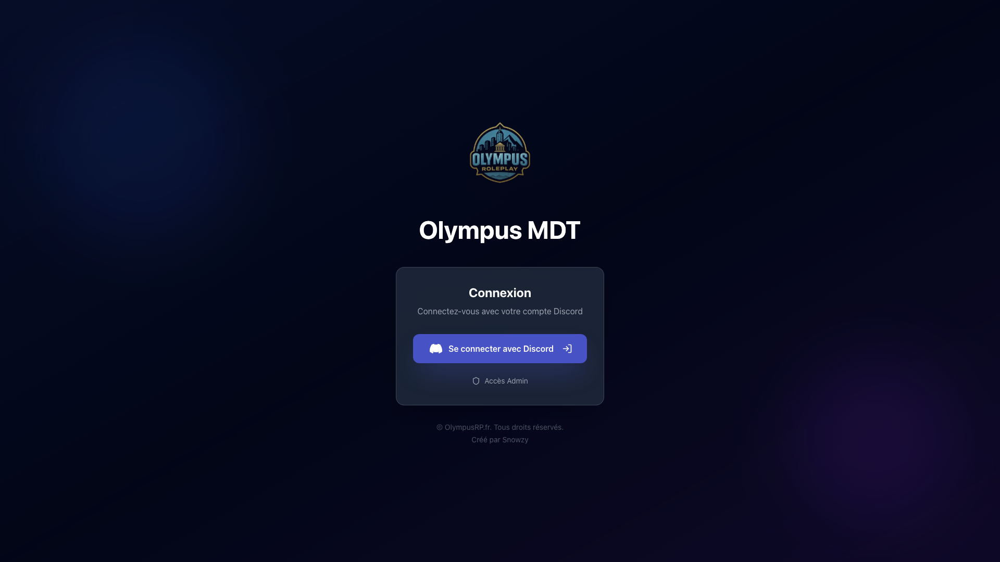
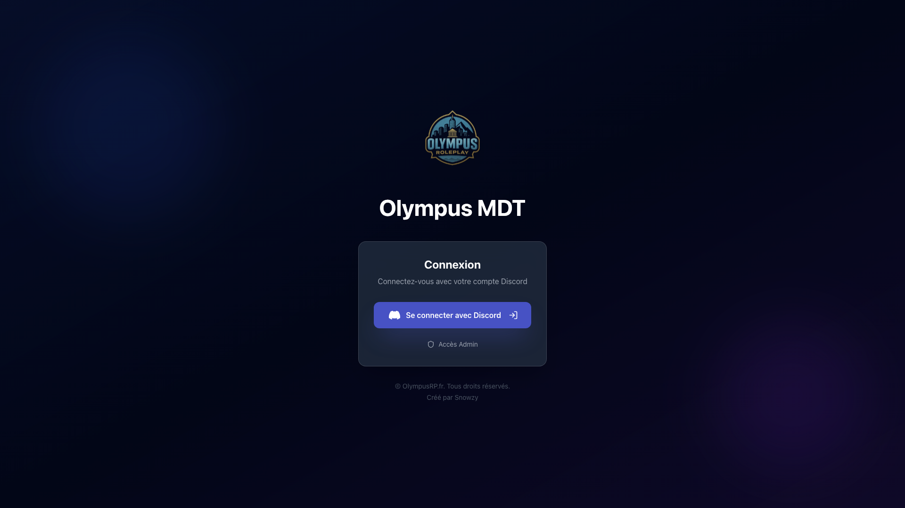

# Review UX/UI Dashboard - OlympusMDT
**Date:** 01/11/2025
**Testeur:** Playwright Advanced Review
**Application:** OlympusMDT - Dashboard Pages

---

## Configuration de Test

**Note:** Ce test utilise une session authentifiée simulée pour accéder aux pages du dashboard.

---

## 1. Dashboard Principal (/dashboard)

### 📊 Analyse Technique

- **Chargement complet:** 257ms

- **DOM Content Loaded:** 40ms

- **First Contentful Paint:** 404.00ms

### ♿ Accessibilité

- **Arbre d'accessibilité:** ✅ Présent

- **Inputs avec labels:** 0/0

### 🎨 Éléments Visuels

- **Animations actives:** 4

- **Éléments interactifs:** 2

  - Boutons: 1

  - Liens: 1

  - Champs de formulaire: 0

### 🔧 Sidebar

- ⚠️ Sidebar non détectée (peut-être redirection vers login)

### 📈 Cartes de Statistiques: 0

### 📸 Screenshots

---

## 2. Page Plaintes (/dashboard/complaints)

### 📊 Analyse Technique

- **Temps de chargement:** 241ms

- **Éléments interactifs:** 2

- **Filtres (dropdowns):** 0

### 📋 Tableau: 0 lignes détectées

### 🏷️ Badges: 0 détectés

### 📸 Screenshots

---

## 3. Page Événements (/dashboard/events)

### 📊 Analyse Technique

- **Temps de chargement:** 233ms

- **Animations:** 4

### 📸 Screenshots

---

