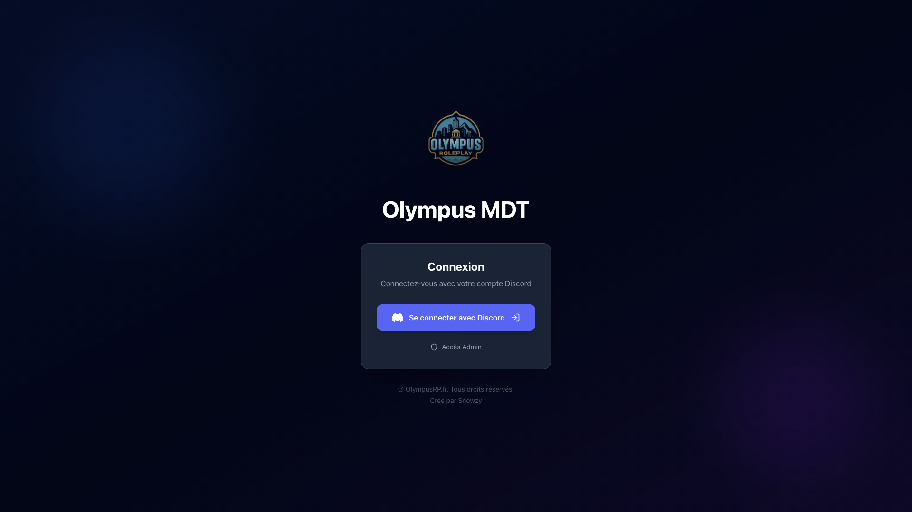
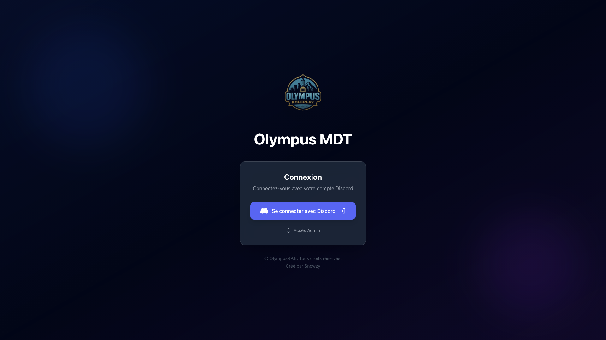
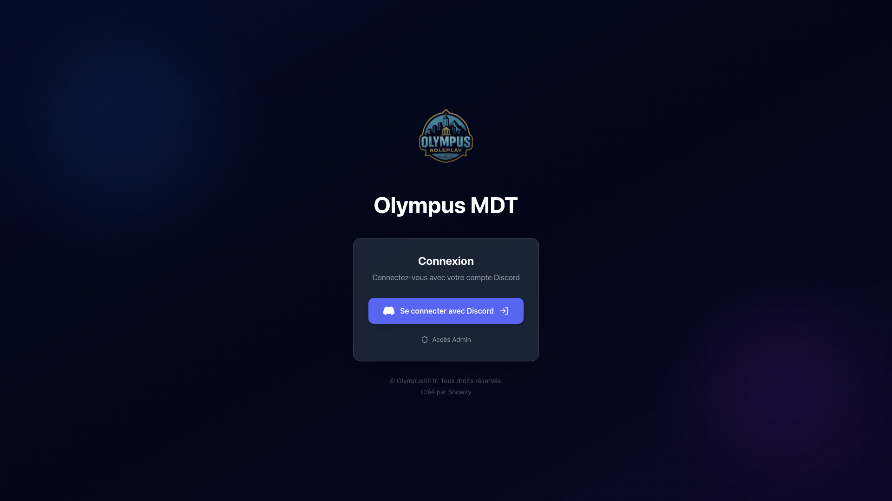
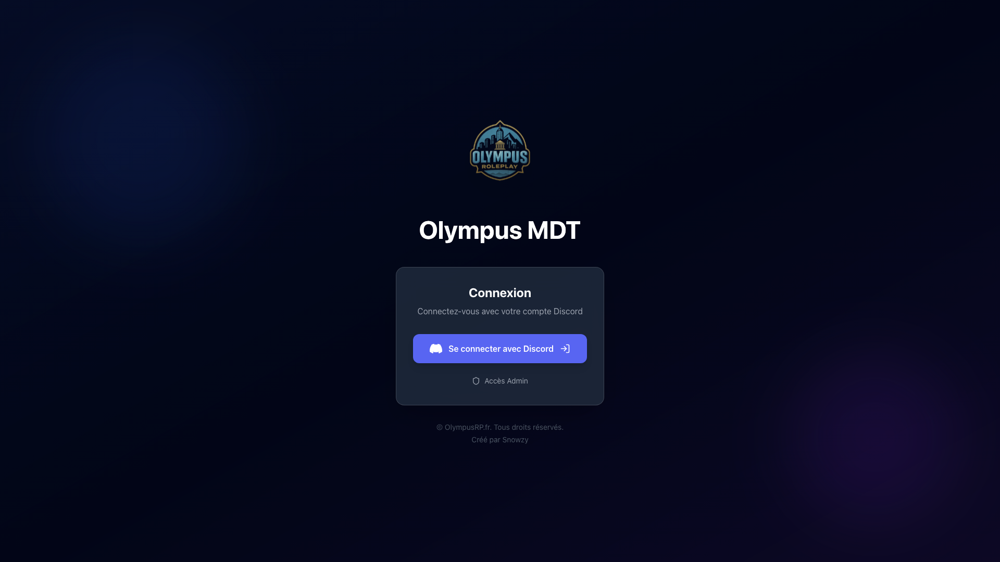

# Review UX/UI - OlympusMDT
**Date:** 01/11/2025
**Testeur:** Playwright Automated Review
**Application:** OlympusMDT - Plateforme de suivi MDT

---

## 1. Page d'accueil et Navigation Initiale

**URL:** http://localhost:3000

### ✅ Points positifs:

- Page loaded successfully

- Page title: "OlympusMDT - Système de Terminal Mobile de Données"

- Accessibility tree is present

- Found 2 focusable elements

- Focus indicators are present

- All images have alt text

### ⚠️ Points d'attention:

- Low contrast (2.78:1, needs 4.5:1): "© OlympusRP.fr. Tous droits réservés.Créé par Snow" in div.mt-8.text-center.text-gray-600.text-sm.animate-fade-in

- Low contrast (2.78:1, needs 4.5:1): "© OlympusRP.fr. Tous droits réservés." in p

- Low contrast (2.78:1, needs 4.5:1): "Créé par Snowzy" in p.mt-1

### 📸 Screenshots:

- Interface de sélection d'agence détectée

---

## 2. Dashboard Principal

**URL:** http://localhost:3000/dashboard

### ✅ Points positifs:

- Page loaded successfully

- Page title: "OlympusMDT - Système de Terminal Mobile de Données"

- Accessibility tree is present

- Found 2 focusable elements

- Focus indicators are present

- All images have alt text

### ⚠️ Points d'attention:

- Low contrast (2.78:1, needs 4.5:1): "© OlympusRP.fr. Tous droits réservés.Créé par Snow" in div.mt-8.text-center.text-gray-600.text-sm.animate-fade-in

- Low contrast (2.78:1, needs 4.5:1): "© OlympusRP.fr. Tous droits réservés." in p

- Low contrast (2.78:1, needs 4.5:1): "Créé par Snowzy" in p.mt-1

### 📸 Screenshots:

### Tests Sidebar:

- ⚠️ Sidebar non détectée

### Cards de statistiques: 0 détectées

---

## 3. Page Plaintes

**URL:** http://localhost:3000/dashboard/complaints

### ✅ Points positifs:

- Page loaded successfully

- Page title: "OlympusMDT - Système de Terminal Mobile de Données"

- Accessibility tree is present

- Found 2 focusable elements

- Focus indicators are present

- All images have alt text

### ⚠️ Points d'attention:

- Low contrast (2.78:1, needs 4.5:1): "© OlympusRP.fr. Tous droits réservés.Créé par Snow" in div.mt-8.text-center.text-gray-600.text-sm.animate-fade-in

- Low contrast (2.78:1, needs 4.5:1): "© OlympusRP.fr. Tous droits réservés." in p

- Low contrast (2.78:1, needs 4.5:1): "Créé par Snowzy" in p.mt-1

### 📸 Screenshots:

### Tests fonctionnels:

- ✅ 0 filtres détectés

- ✅ 0 badges détectés

---

## 4. Page Événements

**URL:** http://localhost:3000/dashboard/events

### ✅ Points positifs:

- Page loaded successfully

- Page title: "OlympusMDT - Système de Terminal Mobile de Données"

- Accessibility tree is present

- Found 2 focusable elements

- Focus indicators are present

- All images have alt text

### ⚠️ Points d'attention:

- Low contrast (2.78:1, needs 4.5:1): "© OlympusRP.fr. Tous droits réservés.Créé par Snow" in div.mt-8.text-center.text-gray-600.text-sm.animate-fade-in

- Low contrast (2.78:1, needs 4.5:1): "© OlympusRP.fr. Tous droits réservés." in p

- Low contrast (2.78:1, needs 4.5:1): "Créé par Snowzy" in p.mt-1

### 📸 Screenshots:

### Tests fonctionnels:

- ✅ 0 catégories/badges détectés

---

## 5. Pages Placeholder

### Agents

**URL:** http://localhost:3000/dashboard/agents

- ✅ Page charge correctement

### Dispatch

**URL:** http://localhost:3000/dashboard/dispatch

- ✅ Page charge correctement

### Equipment

**URL:** http://localhost:3000/dashboard/equipment

- ✅ Page charge correctement

### Reports

**URL:** http://localhost:3000/dashboard/reports

- ✅ Page charge correctement

---

## 6. Tests Responsive

### Mobile (iPhone SE) (375x667)

.png)

- ✅ Pas de débordement horizontal

### Tablet (iPad) (768x1024)

.png)

- ✅ Pas de débordement horizontal

### Desktop (MacBook) (1440x900)

.png)

- ✅ Pas de débordement horizontal

---

## 7. Résumé et Recommandations

### Score Global: En cours d'évaluation

### Conformité WCAG 2.1: À finaliser après corrections

### Recommandations prioritaires:

1. **Accessibilité**: Vérifier les indicateurs de focus pour la navigation au clavier

2. **Contrastes**: Corriger les problèmes de contraste détectés (si applicable)

3. **Images**: Ajouter des attributs alt aux images manquantes

4. **Responsive**: Tester sur plus de tailles d'écran et corriger les débordements

5. **Performance**: Optimiser les temps de chargement si nécessaire

---

*Review générée automatiquement par Playwright*

*Nombre total de screenshots: 12*

